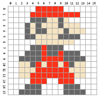

# 2. Übungsblatt 2: Information

<!-- Chapter: 2 -->

## 2.1 Pi als Nachricht
Lässt sich die Zahl π als Nachricht übermitteln? Begründen Sie Ihre Antwort.

## 2.2 Atome im Universum
Schätzungen zufolge besteht das Universum aus einer Tredezillion Atomen (10^78). Welche Bitbreite ist mindestens notwendig, um diese Zahl im Rechner zu speichern? Begründen Sie Ihre Antwort.

## 2.3 Umwandlung zwischen Zahlensystemen (Ganzzahlen)
Vervollständigen Sie die leeren Felder:

|  Dezimal |     Binär |  Oktal |  Hexadezimal |
|----------|-----------|--------|--------------|
|  198     |           |        |              |
|          |  10101101 |        |              |
|          |           |   535  |              |
|          |           |        |  4AC         |

## 2.4 Umwandlung zwischen Zahlensystemen (Bruchzahlen)
Vervollständigen Sie die leeren Felder:

|  Dezimal |  Binär    |  Oktal |  Hexadezimal |
|----------|-----------|--------|--------------|
|  521,125 |           |        |              |
|          |  1011,11  |        |              |
|          |           |   15,7 |              |
|          |           |        |  AC,8        |

## 2.5 Gleitkommazahlen nach IEEE
Während der Fehlersuche stoßen Sie auf das folgende Speicherabbild:

`C0 98 00 00 00 00 00 00`

Welche Werte werden dargestellt, wenn Sie die Werte

1. als zwei IEEE-Gleitkommazahlen einfacher Genauigkeit bzw.
2. als eine IEEE-Gleitkommazahl doppelter Genauigkeit interpretieren?

Nehmen Sie für Ihre Betrachtung an, dass die Bytes in natürlicher Reihenfolge im Speicher abgelegt sind (Big-Endian-Format).

## 2.6 Zweierkomplement
Wandeln Sie die Dezimalzahl -126 in eine binäre Darstellung mit 8 Bit um. Verwenden Sie die Zweierkomplementdarstellung für die Zahl.

## 2.7 Zweierkomplement
Wandeln Sie die Dezimalzahl -1 in eine binäre Darstellung mit 8 Bit um. Verwenden Sie die Zweierkomplementdarstellung für die Zahl.

## 2.8 Zweierkomplement
Wandeln Sie die Dezimalzahl -77 in eine binäre Darstellung mit 8 Bit um. Verwenden Sie die Zweierkomplementdarstellung für die Zahl.

## 2.9 Sinn des Zweierkomplements
Warum ist es sinnvoll, einen Wert im Zweierkomplement darzustellen, bzw. worin liegt der Vorteil zur Darstellung im Einerkomplement?

## 2.10 Rechnen im Binärsystem
Führen Sie die folgenden binären Rechenoperationen durch

  * `110101 + 11001 =`
  * `111011 + 11101 =`
  * `111011 - 10111 =` (mit Zweierkomplement)
  * `110001 - 1101101 =` (mit Zweierkomplement)
  * `11011 * 1011 =`
  * `101,1101 + 1110,11 =`
  * `110,1001 - 101,11011 =`

## 2.11 Rechnen im Binärsystem - Addition
Bitte berechnen Sie binär, ohne in ein anderes Zahlensystem umzuwandeln: `110101 + 11001`

## 2.12 Rechnen im Binärsystem - Addition
Bitte berechnen Sie binär, ohne in ein anderes Zahlensystem umzuwandeln: `111011 + 11101`

## 2.13 Rechnen im Binärsystem - Subtraktion
Bitte berechnen Sie binär, ohne in ein anderes Zahlensystem umzuwandeln: `111011 - 10111` (mit Zweierkomplement)

## 2.14 Rechnen im Binärsystem - Subtraktion
Bitte berechnen Sie binär, ohne in ein anderes Zahlensystem umzuwandeln: `110001 - 1101101` (mit Zweierkomplement)

## 2.15 Bild codieren
Überlegen Sie sich ein Schema, wie das folgende Bild in Bits umgewandelt werden kann. Versuchen Sie die Daten so kompakt wie möglich abzulegen.

Codieren Sie die erste und die letzte Zeile nach Ihrem Schema und geben Sie das Ergebnis an. Gruppieren Sie dabei die Bits in Bytes.

## 2.16 Text codieren
Codieren Sie den folgenden Text in ISO-8859-1 und UTF-8.

"Mögest du viel Spaß haben!"

Geben Sie das Ergebnis als Bytes in hexadezimaler Schreibweise an.

## 2.17 Sampling-Rate
Warum haben CDs eine Abtastrate von 44,1 kHz?

## 2.18 Datenmenge einer CD
Eine CD zeichnet Audiosignale mit 16 Bit bei 44,1 kHz Abtastrate unkomprimiert auf. Wie groß wird eine Stereo-CD mit 70 Minuten Laufzeit ungefähr? Begründen Sie Ihre Antwort.

## 2.19 Umrechnung von Speicherkapazitäten
Eine Festplatte ist mit einer Speicherkapazität von 4 TB angegeben. Wieviele Bytes können Sie darauf speichern? Begründen Sie Ihre Antwort.

