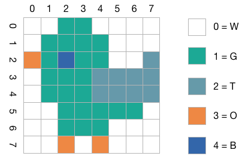

# 3. Kompression und Codierung - Übungen (Musterlösung)

## 3.1 Morse-Alphabet
Warum werden beim Morse-Alphabet manche Buchstaben mit kurzen und manche mit langen Folgen der Zeichen `.` und `-` dargestellt? Handelt es sich beim Morse-Alphabet um eine binäre Codierung? Begründen Sie Ihre Antwort.

*Lösung:*
Um Zeit bei der Übertragung zu sparen, hat man damals schon, lange bevor es Computer gab, häufig auftretende Zeichen mit kurzen und selten auftretende Zeichen mit langen Folgen von `.` und `-` dargestellt. Beim Morse-Alphabet handelt es sich nicht um eine binäre Codierung, da neben `.` und `-` als drittes Zeichen die Pause verwendet wird.

## 3.2 Fano-Bedingung
Genügt die Deutsche Sprache der Fano-Bedingung? Begründen Sie Ihre Antwort.

*Lösung:*
Nein: Es gibt Wörter, die Präfix eines anderen Wortes sind (und zwar sehr viele). Beispiel: Dach und Dackel.

## 3.3 Hamming-Distanz anpassen
Bestimmen Sie die Hamming-Distanz für den Code {1101011, 1010110, 0000011, 0001100} und modifizieren Sie diesen Code dann durch Änderung eines einzigen Bit so, dass sich eine um eins erhöhte Hamming-Distanz ergibt.

Welcher Code ergibt sich dann?

*Lösung:*
```console
         1101011   1010110   0000011   0001100
1101011  -          -        -         -
1010110  5          -        -         -
0000011  3          4        -         -
0001100  5          4        4         -

h = 3
```

```console
         1101111   1010110   0000011   0001100
1101111  -          -        -         -
1010110  4          -        -         -
0000011  4          4        -         -
0001100  4          4        4         -

h = 4
```

## 3.4 Parität
Geben Sie für die folgenden Bitfolgen jeweils das Paritätsbit bei _gerader (even)_ Parität an.

  * `0000000`
  * `0000010`
  * `1000000`
  * `1001001`
  * `1111111`
  * `1010101`

*Lösung:*
* 0000000 -> 0
* 0000010 -> 1
* 1001000 -> 0
* 1001001 -> 1
* 1111111 -> 1
* 1010101 -> 0

## 3.5 Serielle Daten dekodieren
Bei einer seriellen Datenübermittlung werden mit 7 Bit codierte ASCII-Zeichen mit einem zusätzlichen Paritätsbit und einem Längsprüfwort nach jeweils 8 Zeichen gesendet. Es gilt gerade Parität. Es wird folgende Nachricht empfangen:

```console
1000110 1
0110010 0
1100101 0
1101001 0
1100010 1
1101001 0
1100101 0
1110010 0

0100100 0
```

Wie lautet die empfangene Nachricht? Sind Übertragungsfehler aufgetreten? Wenn ja, wie lautet die korrekte Nachricht?

*Lösung:*
Die empfangene Nachricht lautet: `F2eibier`.

```console
1000110 1 <-
0110010 0
1100101 0
1101001 0
1100010 1
1101001 0
1100101 0
1110010 0

0100100 0
 ^
```

Die korrekte Nachricht ist `Freibier`.

## 3.6 CRC-Prüfsumme berechnen
Berechnen Sie für die Nachricht `1101011010` die CRC-Prüfsumme mit dem Prüfpolynom `10011`.

*Lösung:*
```console
11010110100000
10011
--------------
01001110100000
 10011
 -------------
 0000010100000
      10011
      --------
      00111000
        100110
        ------
        011110
         10011
         -----
         01101
```

Die Nachricht mit Prüfsumme ist damit `11010110101101`

Probe

```console
11010110101101
10011
--------------
 1001110101101
 10011
 -------------
      10101101
      10011
      --------
        110101
        10011
        ------
         10011
         10011
         -----
             0
```

## 3.7 Daten mit CRC prüfen
Sie haben die Nachricht `10101010100010` erhalten. Das Prüfpolynom ist `10001`. Ist die Nachricht korrekt übertragen worden? (Geben Sie auch den Rechenweg an.)


*Lösung:*
```console
10101010100010
10001
--------------
  100010
  10001
  ------------
        100010
        10001
        ------
            00
```
Ja, die Nachricht wurde korrekt übertragen, da das Ergebnis der XOR-Division 0 ist.

## 3.8 Komprimierung mit RLE
Komprimieren Sie das folgende Bild mit Hilfe eines Run-Length-Encodings (RLE). Geben Sie das Ergebnis an. Verwenden Sie der Einfachheit halber für alle Pixel eine Längenangabe und verzichten Sie auf das Markierungsbyte. Sie können anstatt der Byte-Folge einen Buchstaben für jede Farbe verwenden, z.B. `w` für weiß, `b` für blau etc.


Wieviel Platz spart Ihre Codierung im Vergleich zu einer Speicherung ohne Kompression?

*Lösung:*
```console
2w 4b 3w 6b 1w  2b 1s 1w 1b 1s
1w 3b 2w 1b 2w 16b 2b 1w 2b 1w
3b 8w
```

Man benötigt 22 Bytes für das Bild mit einem Run-Length-Encoding.

Ohne sind 8x8 /2 = 32 Bytes nötig.

## 3.9 Huffman-Code bestimmen
Erstellen Sie für das folgende Bild einen Huffman Code und codieren Sie es damit



*Lösung:*
Es sind 64 Pixel, davon sind

  - 28 Weiß - `0`
  - 23 Grün - `10`
  - 9 Türkis - `110`
  - 3 Orange - `1110`
  - 1 Blau - `1111`


```console
   0    0   10   10    0    0    0    0
   0   10   10   10   10    0    0    0
1110   10 1111   10   10    0    0  110
   0   10   10   10  110  110  110  110
   0   10   10   10  110  110  110  110
   0    0   10   10   10   10   10    0
   0    0   10   10   10    0    0    0
   0    0 1110    0 1110    0    0    0
```

## 3.10 Huffman-Code bestimmen
Gegeben ist folgende Häufigkeitsverteilung für eine Menge von Zeichen:

| Zeichen       | R | I | C | H | T | G |
|---------------|---|---|---|---|---|---|
| Häufigkeit [%]|25 |21 |19 |18 |13 |4  |

Generieren Sie einen Huffman-Code für die angegebene Menge

Dekodieren Sie folgende Nachricht (von links nach rechts!) `0010110100110100111` mittels des generierten Code.

*Lösung:*


Die Nachricht ist `00 10 11 010 0110 10 0111` = `RICHTIG`

## 3.11 Verlustfreie- und Verlustbehaftete Kompression
Geben Sie für die folgenden Verfahre an, ob sie verlustbehaftete oder verlustfreie Kompressionsverfahren sind:

  * RLE
  * LZ77
  * LZW
  * MP3
  * H.264 (MPEG-4)
  * FLAC
  * GZIP
  * JPEG

*Lösung:*
Verlustfreie Verfahren: RLE, LZ77, LZW, FLAC, GZIP
Verlustbehaftete Verfahren: MP3, H.264, JPEG

## 3.12 Vektorgrafik vs. Bitmap
  1. Wie funktioniert die Speicherung von Bildern als _Vektorgrafiken_? Welche Datei-Formate kennen Sie?
  2. Wie funktioniert die Speicherung von Bildern als _Bitmaps_ bzw. _Rastergrafiken_? Welche Datei-Formate kennen Sie?
  3. Welches Format sollte man für welche Art von Bildern/Grafiken einsetzen?

*Lösung:*
  1. Bei einer _Vektorgrafik_ besteht das Bild aus grafischen Primitiven (Linie, Kreis, Kurven etc.), also den Zeichenanweisungen, die als Resultat das endgültige Bild ergeben. Damit sind sie prinzipiell unabhängig von einer Auflösung, d.h. sie können in beliebiger Auflösung und Detailtiefe gezeichnet werden. Bekannte Formate sind:
    * svg - Scalable Vector Graphics
    * ai - Adobe Illustrator
    * emf - Windows Enhanced Metafile
    * dwg - AutoCAD
  2. Bei einem _Bitmap_ handelt es sich um ein Bild in einer festen Auflösung, bei dem für jeden Bildpunkt der Farbwert gespeichert ist. Das Bild ist also _gerastert_, daher auch der Begriff _Rastergrafik_. Bitmaps haben immer genau eine Auflösung. Vergrößerungen oder Verkleinerungen gehen immer mit einem Verlust an Information einher. Bekannte Formate sind:
    * bmp - Windows Bitmap
    * gif - Graphics Interchange Format
    * jpg - JPEG File Interchange Format
    * png - Portable Network Graphics
    * psd - Photoshop Document
    * tiff - Tagged Image File Format
  3. Vektorgrafik eignet sich für Illustrationen und Zeichnungen, Bitmaps für Fotos.

## 3.13 Speicherverbrauch eines Bildes
Das folgende Bild (Auflösung 640x466 Pixel) hat mit JPEG-Kompression (75% Qualität) eine Größe von 111.431 Byte.


  1. Wie viel Speicher würde man benötigen, wenn man es unkomprimiert ablegen wollte. Gehen Sie von 8 Bit pro Farbkanal (RGB) ohne Alphakanal aus. Ignorieren Sie die Header und Metadaten.
  2. Wie stark ist somit die Kompression, d.h. um welchen Faktor wird das Bild durch sie kleiner?

*Lösung:*
  1. Das Bild hat 640x466 Pixel = 298.240 Pixel. Bei 3 Byte pro Pixel (jeweils eines für Rot, Grün und Blau) benötigt man 640x466x3 Byte =  894.720 Byte.
  2. Der Kompressionsfaktor beträgt 894.720/111.431 = 8.029, also ca. 8.

## 3.14 GIF oder JPEG für Comics
Warum ist das GIF-Dateiformat besser geeignet, um farbige Comics zu speichern, als JPEG? Gibt es noch ein anderes Bildformat, dass sich für Comics eignet und das möglicherweise noch besser als GIF ist?

*Lösung:*
Comics haben größere farbige Flächen und nur eine geringe Anzahl von Farben. JPEG ist für Fotos mit vielen unterschiedlichen Farben und feinen Strukturen entwickelt worden. GIF (oder PNG) speichern Paletten und das Bild komprimiert ab: Anstatt 3x8 Bit benötigen sie nur 8 Bit pro Pixel für den Paletteneintrag.

## 3.15 JPEG in der Fotografie
Viele Fotografen speichern ihre Bilder, solange sie diese noch bearbeiten, im TIFF-Format und erzeugen JPEGs erst ganz am Ende der Bearbeitung. Warum?

*Lösung:*
Bei JPEG handelt es sich um eine verlustbehaftete Kompression, d.h. bei jedem Speichern gehen Informationen aus dem Bild verloren. Bearbeitet man ein Bild mehrmals uns speichert es dann immer wieder, wird die Qualität sichtbar schlechter. Deswegen ist es besser, während der Bearbeitung ein verlustfreies Format einzusetzen und daraus erst am Ende das JPEG zu erzeugen.

## 3.16 Funktionsweise von MP3
Welche Eigenschaft des menschlichen Hörsinns wird vom MP3-Format genutzt?

*Lösung:*
MP3 bedient sich der Psychoakustik und speichert nur für den Menschen wahrnehmbare Anteile des Signals. Dadurch wird bei nicht oder nur kaum verringert wahrgenommener Audioqualität eine starke Reduktion der Datenmenge möglich. (Manche HIFI-Enthusiasten sehen das übrigens anders und widersprechen der Aussage zur kaum verringerten Audioqualität.)

