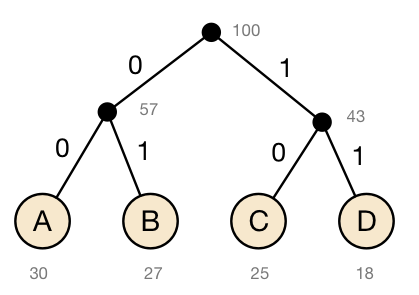

# 3. Codes - Test (Musterlösung) (100 Punkte)


## 3.1 Hamming-Distanz (20 Punkte)
Bestimmen Sie die _Hamming-Distanz_ des folgenden Codes: 1111, 0100, 1001

*Lösung:*

```console
      1111     0100     0001
1111  -        -        -
0100  3        -        -
1001  2        3        -

h = 2
```

## 3.2 Parität (10 Punkte)
Geben Sie für die folgenden Bitfolgen jeweils das Paritätsbit (gerade Parität) an.

  - 1001010
  - 1100011
  - 1111111

*Lösung:*

  - 1001010 -> 1
  - 1100011 -> 0
  - 1111111 -> 1

## 3.3 Daten mit CRC prüfen (30 Punkte)
Sie haben die Nachricht `10101010100010` erhalten. Das Prüfpolynom ist `10001`. Ist die Nachricht korrekt übertragen worden? (Geben Sie auch den Rechenweg an.)


*Lösung:*
```console
10101010100010
10001
--------------
  100010
  10001
  ------------
        100010
        10001
        ------
            00
```
Ja, die Nachricht wurde korrekt übertragen, da das Ergebnis der XOR-Division 0 ist.

## 3.4 Huffman-Code bestimmen (20 Punkte)
Bestimmen Sie für folgende Daten einen _Huffman-Code_. Geben Sie auf jeden Fall zusätzlich den Baum an, den Sie zur Bestimmung des Codes eingesetzt haben.

| Zeichen       | A | B | C | D |
|---------------|---|---|---|---|
| Häufigkeit [%]|30 |27 |25 |18 |

*Lösung:*



| Zeichen       | A | B | C | D |
|---------------|---|---|---|---|
| Codierung     |00 |01 |10 |11 |

## 3.5 Fano-Bedingung (10 Punkte)

Bitte markieren Sie unten _alle_ korrekten Aussagen:

  * [X] Der Code `{ 011,001,0100,10 }` erfüllt die Fano-Bedingung
  * [ ] Der Code `{ 1100,101,0100,10 }` erfüllt die Fano-Bedingung
  * [X] Der Code `{ 1000,1100,1001,101 }` erfüllt die Fano-Bedingung.
  * [X] Ein Code erfüllt die Fano-Bedingung, wenn keines der Codeworte Präfix eines anderen ist.
  * [ ] Ein Code erfüllt die Fano-Bedingung, wenn alle Codeworte gleich lang sind.
  * [ ] Ein Code verletzt die Fano-Bedingung, sobald eins der Codeworte Teil eines anderen ist.
  * [ ] Ein Code erfüllt die Fano-Bedingung, wenn die Codeworte alle unterschiedliche Längen besitzen.
  * [ ] Ein Code erfüllt die Fano-Bedingung, wenn keins der Codeworte Suffix eines anderen ist.

## 3.6 Funktionsweise von MP3 (10 Punkte)
Welche der folgenden Aussagen treffen auf das _MP3-Format_ zu?

  * [X] bedient sich der Psychoakustik
  * [ ] bedient sich der Psychologie
  * [ ] bedient sich der Trägheit der Luft als Medium
  * [X] speichert nur für den Menschen wahrnehmbare Anteile des Signals
  * [ ] reduziert die Auflösung des Signals in allen Frequenzbereichen
  * [ ] basiert auf dem Shannon-Theorem
  * [X] ist verlustbehaftet
  * [ ] ist verlustfrei
  * [X] hat eine konstante Bitrate
  * [X] hat eine variable Bitrate
  * [X] verringert die Datenmenge im Vergleich zu WAV

