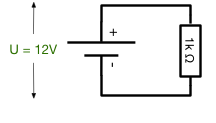

# 5. Digitale Logik - Übungen (Musterlösung)

Hinweis: Die Aufgaben verwenden der Einfachheit halber die Symbole aus Java für die Darstellung der

  * _Konjunktion_ (AND): `&`,
  * _Disjunktion_ (OR): `|` und
  * _Negation_ (NOT): `!`
  * _Exklusiv Oder_ (XOR): `^`

## 5.1 Beweis De Morgansche Gesetz
Beweisen Sie mit Hilfe einer Wahrheitstabelle das De Morgansche Gesetz:
`!(P | Q) = !P & !Q`

*Lösung:*
```console
P   Q   !(P | Q)  !P & !Q
---------------------------
T   F       F         F
T   T       F         F
F   F       T         T
F   T       F         F
```

## 5.2 Ausdruck in Wahrheitstabelle darstellen
Stellen Sie eine Wahrheitstabelle für folgenden Ausdruck auf (P und Q sind Aussagen, die Wahr `T` oder Falsch `F` sein können): `(P & Q) | (!P & !Q)`

*Lösung:*
```console
P   Q   P & Q   !P & !Q   Ergebnis
------------------------------------
T   F     F         F          F
T   T     T         F          T
F   F     F         T          T
F   T     F         F          F
```

## 5.3 Ausdruck umformen
Vereinfachen Sie durch elementare Umformungen den folgenden Ausdruck: `(A | B) & (!A & B)`. Überprüfen Sie mit einer Wahrheitstabelle, ob das Ergebnis korrekt ist.

*Lösung:*
```console
  (A | B) & (!A & B)
= ((A | B) & !A) & ((A | B) & B)
= (A & !A | B & !A) & (A & B | B & B)
= (B & !A) & (A & B | B)
= (B & !A) & B
= (B & !A)
= !A & B
```

Überprüfung mit Wahrheitstabelle:

```console
A   B   (A | B)  (!A & B)   Ergebnis
---------------------------------------
T   F      T          F           F
T   T      T          F           F
F   F      F          F           F
F   T      T          T           T
```

## 5.4 Logische Funktionen auf Bitfolgen anwenden
Berechnen Sie `(a & !b) | c` für `a = 10111011`, `b = 01101010`, `c = 10101011`. Zeigen Sie an diesem Beispiel, dass `(a & !b) | c = (a | c) & (!b | c)` gilt.

*Lösung:*
```console
           a 10111011
          !b 10010101
      a & !b 10010001
           c 10101011
             --------
(a & !b) | c 10111011

             a 10111011       !b 10010101
             c 10101011        c 10101011
         a | c 10111011   !b | c 10111111
        !b | c 10111111
               --------
(a|c) & (!b|c) 10111011
```

## 5.5 Logische Funktionen auf Bitfolgen anwenden
Bitte berechnen Sie `01001011 & 10101011` durch bitweise Anwendung des Operators `&`.
*Lösung:*
```console
    01001011
 &  10101011
-------------
    00001011
```

## 5.6 Logische Funktionen auf Bitfolgen anwenden
Bitte berechnen Sie `01001011 | 10101011` durch bitweise Anwendung des Operators `|`.
*Lösung:*
```console
    01001011
 |  10101011
-------------
    11101011
```

## 5.7 Logische Funktionen auf Bitfolgen anwenden
Bitte berechnen Sie `01001011 ^ 10101011` durch bitweise Anwendung des Operators `^`.
*Lösung:*
```console
    01001011
 ^  10101011
-------------
    11100000
```

## 5.8 Bits in einem Byte umdrehen
Angenommen, Sie wollen die mittleren 4 Bits eines Bytes umdrehen (z.B. 10101001 -> 10010101), wie gehen Sie am einfachsten vor (Bitmaske und Operation)?

*Lösung:*
Anwendung von XOR mit der Maske `00111100`.

```console
     10101001
   ^ 00111100
   ----------
     10010101
```

## 5.9 Bits maskieren
Angenommen, sie wollen in beliebigen Bitfolgen (8 Bit) die letzten beiden Bits immer auf Null setzen und das erste Bit immer auf Eins setzen, also z.B. aus `00101011` soll `10101000` werden. Wie können Sie dies mit entsprechenden booleschen Operatoren erreichen?

*Lösung:*

Die Bifolge muss zuerst mit `11111100` per `&` und dann mit `100000000` per `|` verknüpft werden, z.B.

```console
   00101011
 & 11111100
 ----------
   00101000
 | 10000000
 ----------
   10101000
```

## 5.10 Disjunktive Normalform
Eine Schaltfunktion y mit drei Eingängen x1, x2, x3 sei durch folgende Funktionstabelle gegeben:

| x1  | x2  | x3  | y  |
|-----|-----|-----|----|
|  0  |   0 |   0 |  0 |
|  0  |   0 |   1 |  1 |
|  0  |   1 |   0 |  1 |
|  0  |   1 |   1 |  0 |
|  1  |   0 |   0 |  0 |
|  1  |   0 |   1 |  1 |
|  1  |   1 |   0 |  1 |
|  1  |   1 |   1 |  1 |

Geben Sie die Schaltfunktion in disjunktiver Normalform an, erstellen Sie das zugehörige KV-Diagramm und vereinfachen Sie die Funktion so weit wie möglich.


*Lösung:*
In die disjunktive Normalform gehen nur die Terme ein, die als Ergebnis eine 1 haben, im konkreten Fall also:

```console
y= (!x1 & !x2 & x3)
 | (!x1 & x2 & !x3)
 | (x1 & !x2 & x3)
 | (x1 & x2 & !x3)
 | (x1 & x2 & x3)
```

Damit erhalten wir als KV-Diagramm


Der reduzierte Ausdruck ist damit:

```console
y = (!x2 & x3) | (x2 & !x3) | (x1 & x2 & x3)
```

Probe über Wahrheitstabelle:

| x1  | x2  | x3  | !x2 & x3    | x2 & !x3    | x1 & x2 & x3 | y |
|-----|-----|-----|-------------|-------------|--------------|---|
|  0  |   0 |   0 |           0 |           0 |            0 | 0 |
|  0  |   0 |   1 |           1 |           0 |            0 | 1 |
|  0  |   1 |   0 |           0 |           1 |            0 | 1 |
|  0  |   1 |   1 |           0 |           0 |            0 | 0 |
|  1  |   0 |   0 |           0 |           0 |            0 | 0 |
|  1  |   0 |   1 |           1 |           0 |            0 | 1 |
|  1  |   1 |   0 |           0 |           1 |            0 | 1 |
|  1  |   1 |   1 |           0 |           0 |            1 | 1 |

Die Funktion ist korrekt.

## 5.11 Gatter erstellen
Erstellen Sie eine Wertetabelle und einen Schaltplan mit möglichst wenig Gattern für die folgende Schaltfunktion:

`f(x1, x2, x3) = (x1 & x2 & !x3) | (x1 & !x2 & !x3)`.

*Lösung:*
```console
            x1 0 0 0 0 1 1 1 1
            x2 0 0 1 1 0 0 1 1
            x3 0 1 0 1 0 1 0 1
   ---------------------------
   f(x1,x2,x3) 0 0 0 0 1 0 1 0
```

Die Funktion kann vereinfacht werden zu: `f(x1, x2, x3) = x1 & !x3`


## 5.12 Oder-Gatter mit vier Eingängen
Entwerfen Sie unter Verwendung von Gattern mit zwei Eingängen ein Oder-Gatter mit vier Eingängen.

*Lösung:*


## 5.13 Schaltung entwerfen
Entwerfen Sie eine Schaltung mit Gattern, die prüft ob einer der Passagiere seinen Gurt geschlossen hat (High-Signal vom Gurtsensor). Ist der Platz leer (Low-Signal vom Sitzplatzsensor) so darf auch der Gurt offen sein. Ist der Platz besetzt und der Gurt offen soll die Schaltung ein High-Signal ausgeben. Verknüpfen Sie dann zwei Sitzplätze zu einem Ergebnis-Signal.

Entwerfen Sie zuerst eine Wahrheitstabelle und geben Sie dann eine Schaltung mit Gattern an.

*Lösung:*
```console
Wahrheitstabelle:

G  S  E
-------
1  1  0
1  0  0
0  1  1
0  0  0
```

Es bietet sich an, für den Schaltungsentwurf auf die disjunktive Normalform zurück zu greifen.

```console
E = !G & S
```

Mit Gattern sieht die Schaltung wie folgt aus:


Für zwei Sitzplätze dann wie folgt:


## 5.14 Leistung einer Schaltung
Berechnen Sie für den unten angegebenen Stromkreis, welche Leistung (in Watt) verbraucht wird.




*Lösung:*
`P = U*I, I = U/R = 12 V / 1000 Ohm = 12 mA => P = 12 V * 12 mA = 0,144 Watt`

## 5.15 Länge eines Kabels USA vs. Europa
In den USA (Netzspannung 120 V) können die Kabel bei gleicher Dicke ungefähr nur ein Viertel (25%) der Länge von Kabeln in Europa (Netzspannung 230V) haben. Warum ist dies so?

*Lösung:*
Die maximale Länge einer Leitung wird durch die Verlustleistung bestimmt, die in der Leitung auftritt. Diese ergibt sich aus dem Spannungsabfall U und dem fließenden Strom I. Der Strom wird durch den Verbraucher am Ende der Leitung bestimmt. So benötigt ein 2400 Watt Fön in den USA einen Strom von 20 A, in Europa aber nur etwas über 10 A. Der Spannungsabfall ergibt sich aus dem Widerstand der Leitung R nach dem Ohmschen Gesetz mit `U = R * I`. Da der Widerstand nur von der Länge der Leitung abhängt, ist `R` unabhängig von der Spannung und dem Strom. Die Verlustleistung ist damit `P = U * I` und wegen `U = R * I` dann `P = R * I * I` bzw. `P = R * I^2`.

In den USA benötigen die Verbraucher bei gleicher Leistung den doppelten Strom. Das führt aber bei gleichem Leitungswiderstand zu einer vierfachen Verlustleistung. Um in Europa und den USA dieselbe Verlustleistung zu erreichen, dürfen die Leitungen nur maximal ein Viertel der Länge haben.

## 5.16 Schaltkreis berechnen
Berechnen Sie für den unten angegebenen Stromkreis alle fehlenden Größen.


*Lösung:*
`R_23 = 470 Ohm, R_56 = 350 Ohm, R_2356 = 200,61 Ohm, R_ges = 500,61 Ohm`
`I_1 = I_2 = 200mA, U_1 = 20 V, U_4 = 40 V, U_5 + U_6 = U_2 + U3 = 40 V`
`I_3 = I_5 = I_7 = U_56 / R_56 = 115 mA`
`I_4 = I_6 = I_8 = U_23 / R_23 = 85 mA`
`U_2 = R_2 * I_4 = 34 V`
`U_3 = R_3 * I_6 = 6 V`
`U_5 = I_3 * R_5 = 5,75 V`
`U_6 = I_5 * R_6 = 34,25 V`

