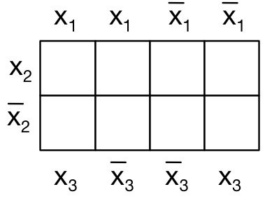
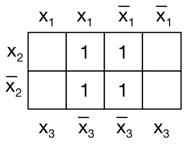

# 5. Digitale Logik - Test (Musterlösung) (100 Punkte)

Hinweis: Die Aufgaben verwenden der Einfachheit halber die Symbole aus Java für die Darstellung der

  * _Konjunktion_ (AND): `&`,
  * _Disjunktion_ (OR): `|` und
  * _Negation_ (NOT): `!`

## 5.1 Leistung eines Wasserkochers (10 Punkte)
Auf einem Wasserkocher steht 230V, 5A. Welche elektrische Leistung nimmt das Gerät auf? (Geben Sie auch den Rechenweg an.)

*Lösung:*
`P = U*I, U = 230V, I = 5A, P = 230V * 5A = 1150 W`

## 5.2 Logische Funktionen auf Bitfolgen anwenden (15 Punkte)
Berechnen Sie `(10010100 & !00101111)`:

*Lösung:*

```console
!00101111 = 11010000

   10010100
 & 11010000
 ----------
   10010000
```

## 5.3 Bits maskieren (20 Punkte)
Angenommen, sie wollen in beliebigen Bitfolgen (8 Bit) die letzten beiden Bits immer auf Eins setzen und die erste zwei Bit umdrehen (0 -> 1, 1 -> 0), also z.B. aus `10101001` soll `01101011` werden. Wie können Sie dies mit entsprechenden booleschen Operatoren erreichen?

*Lösung:*

Die Bifolge muss zuerst mit `11000000` per `^` und dann mit `000000011` per `|` verknüpft werden, z.B.

```console
   10101001
 ^ 11000000
 ----------
   01101001
 | 00000011
 ----------
   01101011
```

## 5.4 Ausdruck in Wahrheitstabelle darstellen (20 Punkte)
Stellen Sie eine Wahrheitstabelle für folgenden Ausdruck auf (P und Q sind Aussagen, die Wahr T oder Falsch F sein können): `(P & !Q) | (!P & !Q)`

*Lösung:*

```console
P   Q   P & !Q    !P & !Q   Ergebnis
------------------------------------
T   F     T         F          T
T   T     F         F          F
F   F     F         T          T
F   T     F         F          F
```

## 5.5 Disjunktive Normalform (35 Punkte)
Eine Schaltfunktion y mit drei Eingängen x1, x2, x3 sei durch folgende Funktionstabelle gegeben:

| x1  | x2  |  x3 | f  |
|-----|-----|-----|----|
|  0  |   0 |   0 |  1 |
|  0  |   0 |   1 |  0 |
|  0  |   1 |   0 |  1 |
|  0  |   1 |   1 |  0 |
|  1  |   0 |   0 |  1 |
|  1  |   0 |   1 |  0 |
|  1  |   1 |   0 |  1 |
|  1  |   1 |   1 |  0 |

Geben Sie die Schaltfunktion in disjunktiver Normalform an und erstellen Sie das dazugehörige KV-Diagramm. Welche optimierte Funktion ergibt sich?



*Lösung:*

Die disjunktive Normalform ist:

```console
f(x1, x2, x3)
  = (!x1 & !x2 & !x3)
  | (!x1 & x2 & !x3)
  | (x1 & !x2 & !x3)
  | (x1 & x2 & !x3)
```

Das KV-Diagramm damit:



Damit ergibt sich die optimierte Funktion als: `f(x1, x2, x3) = !x3`


