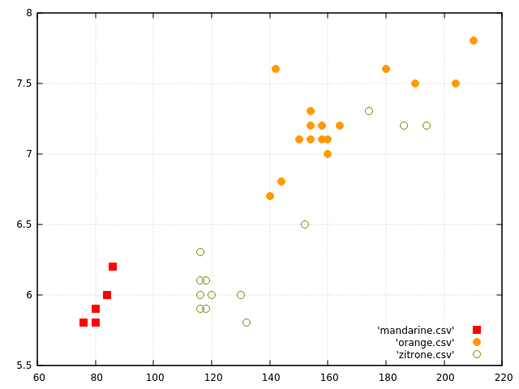
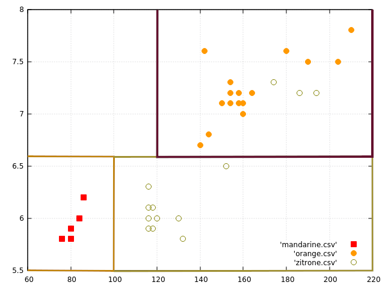
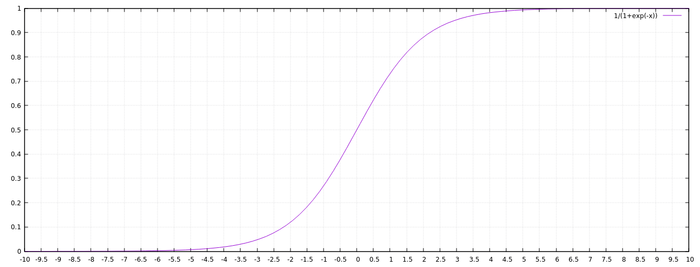

# 9. Künstliche Intelligenz - Übungen (Musterlösung)

## 9.1 Robotergesetze
Isaac Asimov definierte in der Kurzgeschichte "Runaround" bereits 1942 die drei sogenannten _Robotergesetze_. Wie lauten diese?

*Lösung:*
  1. Ein Roboter darf kein menschliches Wesen (wissentlich) verletzen oder durch Untätigkeit (wissentlich) zulassen, dass einem menschlichen Wesen Schaden zugefügt wird.
  2. Ein Roboter muss den ihm von einem Menschen gegebenen Befehlen gehorchen - es sei denn, ein solcher Befehl würde mit Regel eins kollidieren.
  3. Ein Roboter muss seine Existenz beschützen, solange dieser Schutz nicht mit Regel eins oder zwei kollidiert.

## 9.2 Turing Test
Erläutern Sie, was man unter dem Turing-Test versteht. Wann und wo wurde er erstmals beschrieben und wie läuft er ab?

*Lösung:*
Mit dem später sogenannten Turing-Test formulierte Alan Turing im Jahr 1950 eine Idee, wie man feststellen könnte, ob ein Computer, also eine Maschine, ein dem Menschen gleichwertiges Denkvermögen hätte. Dieser Test war zunächst nur eine theoretische Skizze. Sie wurde erst später genauer und konkreter ausformuliert (also nach Turings Suizid 1954; siehe auch Dartmouth Conference, 1956), nachdem die Künstliche Intelligenz als Teilbereich der Informatik, zu einem eigenständigen akademischen Fachgebiet geworden war. Seither ist dieser Test in der Diskussion über Künstliche Intelligenz in aller Munde und dient immer wieder dazu, den Mythos von der denkenden Maschine für das Computerzeitalter neu zu beleben.

## 9.3 Captcha
Heute müssen Internet-Benutzer häufig sogenannte Captchas lösen, um sich bei Webseiten anzumelden. In welchem Zusammenhang stehen Captchas zum Turing-Test?

*Lösung:*
Captcha steht für "completely automated public Turing test to tell computers and humans apart". Es handelt sich um ein Verfahren, um sicherzustellen, dass Eingaben von Menschen und nicht von Robotern stammen. Dem Nutzer werden Aufgaben gestellt, die ein Mensch vergleichsweise leicht, eine Computer aber nur schwer lösen kann. Es handelt sich also um eine Art Turing-Test mit der Besonderheit, dass hier das Ziel ist, Menschen und Computer zu unterscheiden. Beim Original-Turing-Test geht es hingegen darum, dass Mensch und Maschine nicht mehr unterschieden werden können, um den Test zu bestehen.

## 9.4 Typologie künstlicher Intelligenz
Man unterscheidet häufig _vier Typen_ (oder Stufen) von künstlicher Intelligenz. Bitte erläutern Sie diese kurz.

*Lösung:*
  * Type I: Rein reaktiv
  * Type II: System mit begrenztem Gedächtnis
  * Type III: System mit eigenem Bewusstsein
  * Type IV: Sich "seiner selbst" bewusstes System

## 9.5 Schwache vs. Starke KI
Erläutern Sie den Unterschied zwischen einer _schwachen_ und einer _starken_ KI.

*Lösung:*
Im Gegensatz zur starken KI geht es bei der schwachen KI darum, konkrete Anwendungsprobleme des menschlichen Denkens zu meistern. Während die Schaffung starker KI an ihrer philosophischen Fragestellung bis heute scheiterte, sind auf der Seite der schwachen KI in den letzten Jahren bedeutende Fortschritte erzielt worden. Eine starke KI soll eine Intelligenz erschaffen, die das menschliche Denken mechanisiert und sich wie ein Mensch verhält.

Während eine schwache KI einen begrenzten Anwendungsbereich hat, kann eine starke KI generelle Probleme lösen.

## 9.6 Superintelligenz
Definieren Sie kurz in eigenen Worten, was man unter einer _Superintelligenz_ versteht.

*Lösung:*
Superintelligenz (wörtich "Über-Intelligenz") bezeichnet Wesen oder Maschinen mit dem Menschen in vielen oder allen Gebieten überlegener Intelligenz. Der Begriff findet insbesondere im Bereich der Künstlichen Intelligenz Verwendung. Ein tatsächlich geistig überlegenes Wesen, das die Kriterien einer Superintelligenz erfüllt, ist nach heutigem Kenntnisstand nicht bekannt.

## 9.7 Möglichkeiten und Grenzen der KI
Recherchieren Sie in der KI-Literatur bzw. im Internet, inwiefern folgende Probleme heutzutage mittels Computer- bzw. Robotereinsatz gelöst werden können:

  1. Spielen der Brettspiele Dame und Go
  2. Verarbeiten natürlicher Sprache in Echtzeit
  3. Autonomie unbemannter Fahr- und Flugzeuge (UGVs und UAVs)
  4. Automatische Gesichtserkennung
  5. Spielen von Computerspielen (z.B. klassische Atari-Spiele) wie ein Mensch.
  6. Komponieren von Musik.
  7. Turing-Test

Schreiben Sie Ihre Erkenntnisse in jeweils 2–3 Sätzen auf.

*Lösung:*
  1. Checkers is completely solved, optimal game guarantees a tie. The game of Go has been regarded as a benchmark for AI for a long time. Since the number of possible games is much larger than, e.g., in chess, it often was claimed that the game requires human-like creativity. In 2016,Google’s AlphaGo algorithm has beaten Lee Sedol, a world top Go player. [Wikidpedia: Computer Go](http://en.wikipedia.org/wiki/Computer_Go).
  2. Natural language processing is still an open field of research. A major milestone recently was IBM’s Watson computer, which was able to win the first place in the popular quiz show Jeopardy! after competing against former human winners. This involved understanding questions posed in natural language and searching for the answer through a large database of information. [IBM Watson](http://www.research.ibm.com/deepqa/deepqa.shtml).
  3. In the context of the "DARPA Grand Challenge" in 2005 the team of Sebastian Thrun from the Stanford University reached the goal of autonomous navigation of a vehicle through the desert at a route of 200km. By 2016, Google’s Waymo cars have driven autonomously for over 2.7millions kilometers on public roads, with only few accidents caused by the self-driving car. [Wikipedia: Darpa Grand Challenge](http://en.wikipedia.org/wiki/DARPA_Grand_Challenge), [Wikipedia: Driverless Car](http://en.wikipedia.org/wiki/Google_driverless_car=. Autonomous air crafts are comparably easy to construct: [WITAS](http://www.ida.liu.se/ext/witas/),  [Wikipedia: Unmanned Aerial Vehicle](http://en.wikipedia.org/wiki/Unmanned_aerial_vehicle).
  4. In a crowd the rate of correctly recognized people is around 80 percent. In well-controlled settings this rate can be high enough to be used for, e.g., access control in banks, in military or scientific facilities. In these use cases the person have to face the camera frontally and don’t move for some time.
  5. The performance is of course dependent on the game at hand, but a big number of games can be approached by deep learning: [Nature: Human-level control through deep reinforcement learning](http://www.nature.com/nature/journal/v518/n7540/full/nature14236.html)
  6. Several approaches to automatic music generation exist, two most prominent algorithms are: EMI In a training phase the algorithm analyses several music pieces, then it tries to produce a new piece following the style of the input pieces. [Algorithmic Music](http://www.computerhistory.org/atchm/algorithmic-music-david-cope-and-emi). Melomics Instead of copying a given style, Melomics generates a new music piece from some seed value, following general rules of music composition. [Melomics](http://geb.uma.es/melomics)
  7. Chat bots (programs which simulate a conversation by answering to user input) have a long history and have grown quite sophisticated in recent years. They typically use a large online data base, which is extended by analyzing chats with users. However, those bots are still far away from passing the Turing test, mainly because they cannot well understand the semantics and context of a conversation.

## 9.8 Arten des maschinellen Lernens
Definieren Sie in kurzen Sätzen die folgenden Arten des maschinellen Lernens:

  1. _Überwachtes Lernen_ (_supervised learning_)
  2. _Unüberwachtes Lernen_ (_unsupervised learning_)
  3. _Bestärkendes Lernen_ (_reinforced learning_)

*Lösung:*
  1. Überwachtes Lernen (supervised learning) -- Der Algorithmus lernt eine Funktion aus gegebenen Paaren von Ein- und Ausgaben. Dabei stellt man während des Lernens den korrekten Funktionswert zu einer Eingabe bereit.
  2. Unüberwachtes Lernen (unsupervised learning) -- Der Algorithmus erzeugt für eine gegebene Menge von Eingaben ein statistisches Modell, das die Eingaben beschreibt und erkannte Kategorien und Zusammenhänge enthält und somit Vorhersagen ermöglicht.
  3. Bestärkendes Lernen (reinforced learning) -- Der Algorithmus lernt durch Belohnung und Bestrafung eine Taktik, wie in potenziell auftretenden Situationen zu handeln ist.

## 9.9 Machine Learning: Begriffe
Bitte definieren Sie in Ihren eigenen Worten kurz die folgenden zentralen Begriffe aus dem Machine Learning:

  1. Features
  2. Klassifikation (classification)
  3. Trainingsdaten (training data)
  4. Label
  5. Labeled Data / Unlabeled Data
  6. Decision Boundaries
  7. Entscheidungsbaum (decision tree)
  8. Forest
  9. Confusion Matrix

*Lösung:*
  1. Features: Eigenschaften und Werte, die Dinge/Datensätze sinnvoll klassifizieren.
  2. Klassifikation (classification): Einteilen von Datensätze in vorgegebene Kategorien.
  3. Trainingsdaten (training data): Daten, die benutzt werden, um eine künstliche Intelligenz zu trainieren.
  4. Label: Information zu einem Feature, die einem Datensatz zugeordnet ist
  5. Labeled Data / Unlabeled Data: Daten mit bzw. ohne entsprechende Labels
  6. Decision Boundaries: Grenzen, die einen Entscheidungsbereich einteilen.
  7. Entscheidungsbaum (decision tree): Reihe von Entscheidungen, die dazu führen, dass ein Datensatz klassifiziert werden kann
  8. Forest: Ansammlung vieler Entscheidungsbäume
  9. Confusion Matrix


## 9.10 Neuron
Ein künstliches Neuronales Netz besteht aus sogenannten _künstlichen Neuronen_. Erläutern Sie kurz, wie ein solches Neuron funktioniert.

*Lösung:*
Ein künstliches Neuron basiert auf dem Modell einer biologischen Nervenzelle. Es hat mehrere Eingänge und genau einen Ausgang. Die Werte an den Eingängen werden gewichtet und dann durch eine Übertragungsfunktion zusammengefasst. Die Ausgabe bestimmt sich aus der Aktivierungsfunktion und eines Schwellwertes. Wird der Schwellwert nach Anwendung der Aktivierungsfunktion überschritten, so gibt das Neuron den anhand der Aktivierungsfunktion berechneten Wert aus, andernfalls 0.


## 9.11 Entscheidungsbaum erstellen
Gegeben sind Messwerte für das Gewicht und den Durchmesser von Mandarinen, Orangen und Zitronen, die als CSV-Dateien vorliegen:

  1. Mandarinen: [mandarine.csv](data/mandarine.csv)
  2. Orangen: [orange.csv](data/orange.csv)
  3. Zitrone: [zitrone.csv](data/zitrone.csv)

_Zeichnen_ Sie die Daten in einem Diagramm und definieren Sie dann basierend darauf einen _Classifier_ in Form eines Entscheidungsbaums, der aufgrund von Gewicht und Größe die Daten den drei Klassen "Mandarine", "Orange" oder "Zitrone" zuordnet.

Tipp: Die Daten lassen sich sehr leicht mit dem Werkzeug [GNUPlot](http://www.gnuplot.info) in einem Diagramm ausgeben.

Wie viele Objekte (Obststücke) aus den Beispieldateien werden durch Ihren Classifier _richtig_, wie viele _falsch_ klassifiziert?

Sie finden ein _unbekanntes Objekt_ in einem Obstkorb, mit einer Masse von 140g und einem Durchmesser von 6cm. Um was handelt es sich Ihrer Meinung nach?

*Lösung:*
### Zeichnen der Daten

GNUPlot-Skript:
```console
set pointsize 1.5
set style line 1 lc rgb '#ff0000' pointtype 5   # square
set style line 2 lc rgb '#009933' pointtype 7   # circle
set style line 3 lc rgb '#ff9900' pointtype 7   # triangle
set style line 4 lc rgb '#808000' pointtype 6   #
set key right bottom
plot 'mandarine.csv' w p ls 1, 'orange.csv' w p ls 3, 'zitrone.csv' w p ls 4
```





### Entscheidungsbaum

`Durchmesser <= 6,6 und Gewicht <= 100: Mandarine`
`Durchmesser <= 6,6 und Gewicht > 100: Zitrone`
`Durchmesser > 6,6 und Gewicht > 100: Orange`

### Qualität

  * Mandarinen: 5 von 5 richtig (100%)
  * Zitronen: 10 von 13 richtig (77%)
  * Orangen: 16 von 16 richtig (100%)

### Unbekanntes Objekt

Bei dem unbekannten Objekt handelt es sich wahrscheinlich um eine Zitrone.

## 9.12 Berechnungen an einem Neuron
Gegeben sei ein künstliches Neuron mit drei Eingängen (x1, x2 und x3) (und einem Ausgang a). Die Gewichte für die drei Eingänge sind:

`(w1, w2, w3) = (0.3, 0.5, 0.2)`

Als Aktivierungsfunktion wird die Sigmoid-Funktion verwendet, wobei vorher noch ein Bias addiert wird. Der Bias beträgt konstant -2.0. Den Verlauf der Sigmoid-Funktion `f` für das Neuron können Sie aus folgender Grafik ableiten (`f(x) = 1 / (1 + exp(-x))`):



Berechnen Sie für folgende Werte die Ausgabe des Neurons:

`(x1, x2, x3) = (4.3, 2.6, 2.0)`

*Lösung:*


  * Gewichtete Summe der Eingabewerte: `0.3 * 4.3 + 0.5 * 2.6 + 0.2 * 2.0 = 2.99`
  * Plus Bias: `2.99 + (-2.0) = 0.99`
  * Die Ausgabe a ergibt sich aus der Sigmoid-Funktion: `a = 0.73`

